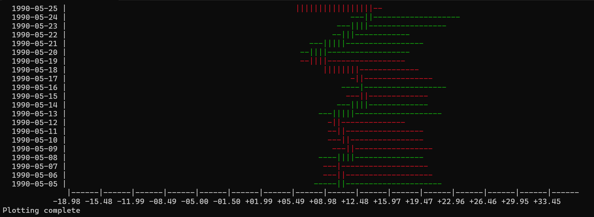

# Terminal Weather Data Visualizer

A C++ terminal application to read, filter, and visualize weather data from a CSV file using candlestick-style ASCII plots.

## Features

- **CSV Parsing**: Reads weather data from a CSV file with dynamic detection of country codes from headers.
- **Candlestick Visualization**: Displays temperature trends using red/green terminal plots similar to stock market charts.
- **Menu-Driven Interface**:
  - `1`: Print Help  
  - `2`: List Country Codes  
  - `3`: Print Candlestick Data (by day/month/year)  
  - `4`: Plot Candlestick Data   
  - `5`: Filter and Plot Data by Date Range

## How It Works

1. The app loads data from a `data.csv` file.
2. You can select country codes and filter by time (day, month, year).
3. Plots are rendered in terminal using ASCII characters (`|`, `-`, etc.).
4. Red/green colors indicate temperature drop or rise compared to the previous point.

## Requirements

- C++17 or above
- Standard C++ libraries (no external dependencies)
- A terminal that supports ANSI color codes (for red/green visualization)

## Example Plot

